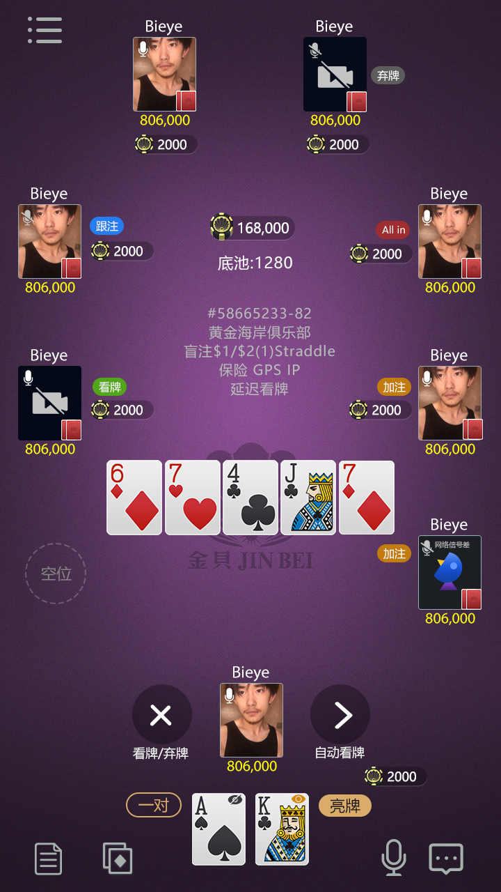
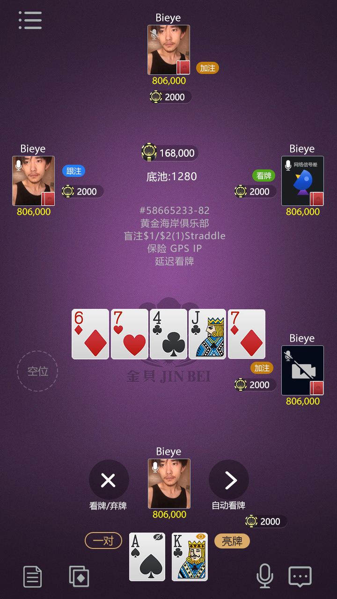
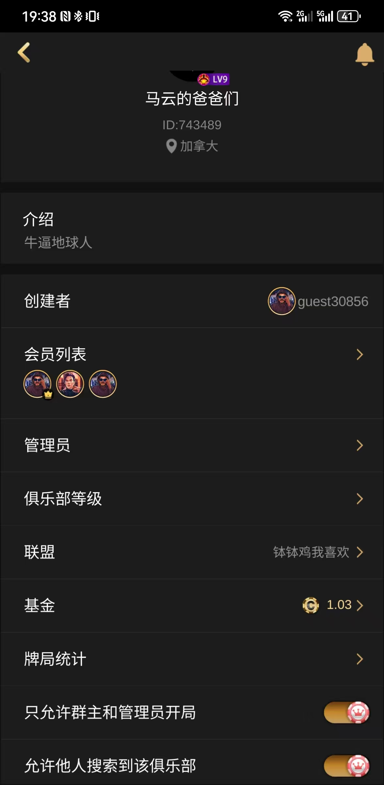
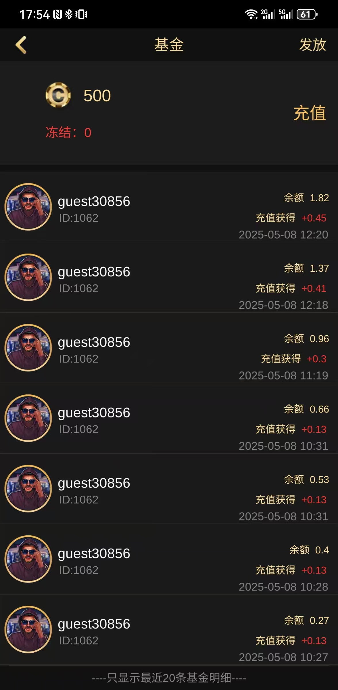
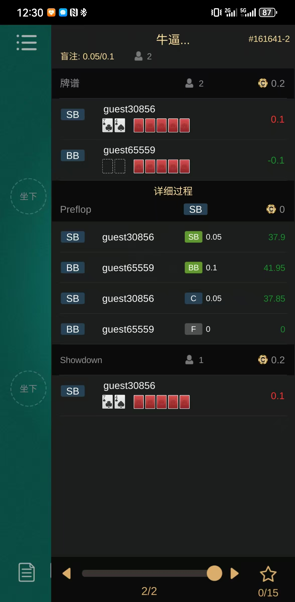
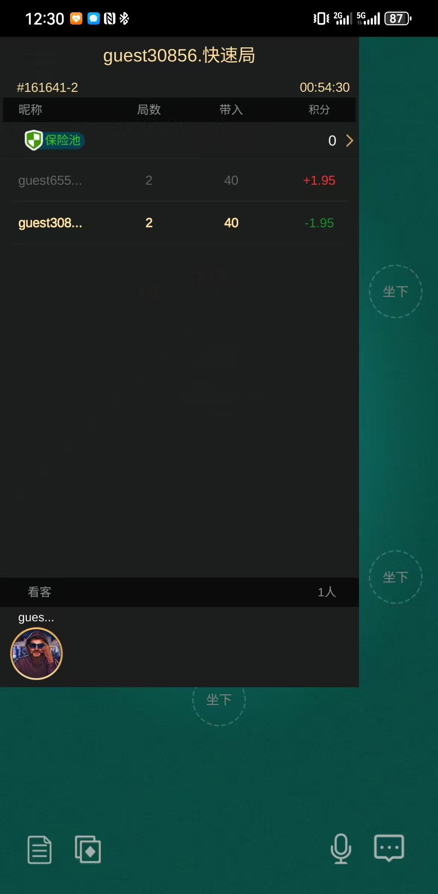
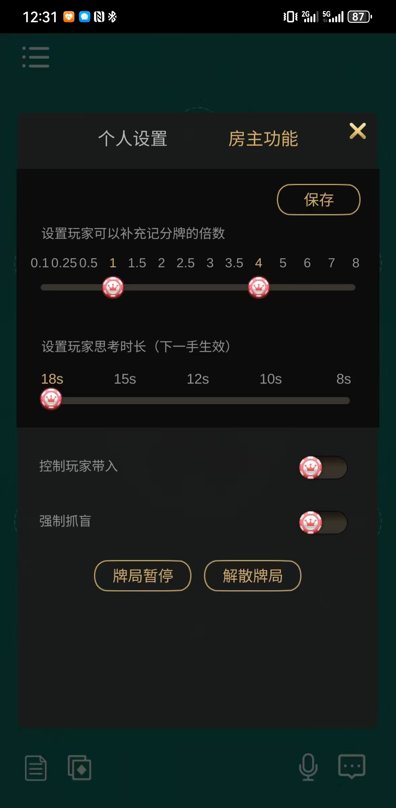
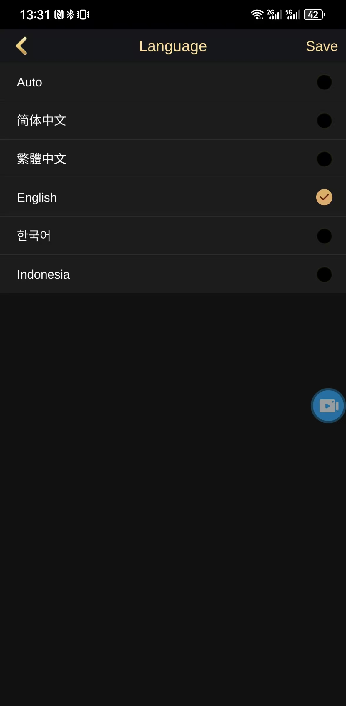

# 在线多人德州扑克平台源码

**C++ / Tars 房间服务，覆盖私人房、快速场、AOF、短牌、SNG、MTT/淘汰赛、保险、牌谱与俱乐部基金流程。**

[简体中文](README.md) · [繁體中文](README.zh-TW.md) · [English](README.en.md) · [产品网站](https://masterai-top.github.io/Online-Texas-Holdem-Poker-Platform/)



## 项目定位

该仓库展示在线多人德州扑克房间与牌桌服务的核心代码结构。它不是只有静态界面的演示项目：仓库中的 `Room.cpp`、`Player.h`、`RoomServant.tars`、消息处理代码和游戏模块，体现了从匹配、入桌、下注、旁观、掉线到结算记录的服务端流程。

适合用于评估或二次开发在线德州扑克服务、私人局、俱乐部房间、SNG 与 MTT 赛事房间。完整上线仍需按实际环境接入配置、数据库、网关、支付、风控和客户端。

## 已验证的玩法与房间类型

| 模式 | 代码中体现的能力 |
|---|---|
| 私人房 / 好友局 | 私人房间类型、房主控制、买入与结算数据 |
| 快速开始 | Quick Start 专用牌桌管理流程 |
| AOF | All-in or Fold 独立模式处理 |
| 短牌 | Short Deck 专用牌桌类型 |
| SNG | 报名、排名、淘汰与比赛状态 |
| MTT / 淘汰赛 | 锦标赛房间、晋级排名与奖池相关接口 |
| 保险 / 多次发牌 | 保险请求与牌桌展示；Run It Twice 相关消息处理 |

## 产品功能

- **玩家与桌台状态**：大厅、房间、坐下、游戏、离线、旁观和匹配状态。
- **牌桌操作**：坐下/站起、下注、买入、延时、自动操作和公共牌展示。
- **牌局记录**：牌局回放、收藏、行动轨迹与结果记录。
- **俱乐部能力**：俱乐部房间信息、成员管理界面、基金发放与流水。
- **房主管理**：买入倍数、行动时间、暂停及解散等控制入口。
- **订单接口**：iOS 与 Google Play 订单生成、校验及消耗校验接口。
- **模块化游戏**：通过动态 `.so` 模块加载不同房间与玩法实现。

## 产品截图

### 实时牌桌与多玩家操作



### 俱乐部与资金管理

| 俱乐部管理 | 俱乐部基金流水 |
|---|---|
|  |  |

### 牌谱、结果与房主控制

| 牌局回放 | 房间结果 |
|---|---|
|  |  |



## 典型玩家流程

1. 玩家登录并进入大厅，选择公开匹配、俱乐部或私人房。
2. 服务端完成房间分配，记录坐下、旁观、离线与重连状态。
3. 玩家买入后参与牌局，执行下注、延时、托管、保险等操作。
4. 牌局结束后生成结果、牌谱和相关俱乐部资金记录。
5. SNG/MTT 场景继续处理报名、排名、淘汰及奖池流程。

## C++ / Tars 技术结构

```text
客户端 / 网关
      ↓
RoomServant（房间请求、离线与通知）
      ↓
Room / PlayerMng / TableManager
      ↓
Quick · AOF · Short Deck · Private · SNG · MTT
      ↓
配置 / 数据库代理 / 日志 / 活动 / 大厅等外部服务
```

关键文件包括 `GameDataDef.h`、`Room.cpp`、`Player.h`、`message/onclientmessage.cpp`、`RoomServant.tars` 与 `OrderServant.tars`。仓库也包含机器人/决策接口，但不应把它等同于一个完整、可直接商用的德州 AI 产品。

## 多语言界面

产品截图显示简体中文、繁體中文、English、한국어 与 Bahasa Indonesia 入口。本优化包提供简体、繁体和英文说明页面，便于搜索引擎区分语言版本。



## 仓库范围与部署说明

本仓库展示核心服务与协议代码，不保证单独克隆后即可完整上线。生产部署通常还需要匹配版本的 Tars 环境、配置中心、数据库/缓存、网关、客户端、支付凭证、日志监控、安全与合规配置。请先审计代码并在隔离环境完成联调和压力测试。

## 联系方式

- Telegram：[@xuzongbin001](https://t.me/xuzongbin001)
- Email：[masterai918@gmail.com](mailto:masterai918@gmail.com)

> 请遵守所在地关于软件、数据、支付和游戏运营的法律法规。本项目说明仅用于技术评估与合规开发。
